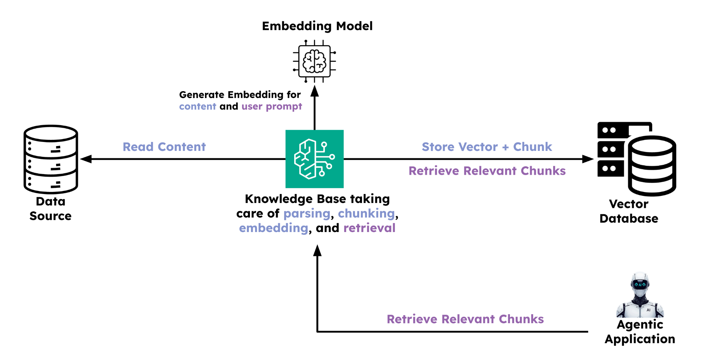

# Challenge: Context Engineering (RAG)

This challenge is about building what the instructor demonstrated in the section videos. Your goal is to implement RAG end-to-end by building an AWS Knowledge Base, populating a vector database, and integrating it into the application. The current folder contains the reference implementation from the instructor. You can refer to that code as well as the README.md in this folder for guidance.

> **Cost note:** This challenge uses AWS Knowledge Base with an embedding model and Pinecone as a vector store. Both have free tiers that should comfortably cover a dev/test setup — just avoid syncing large document sets unnecessarily.

---

## Task 1: Create a Data Source Compatible with AWS Knowledge Base

There are [multiple data sources compatible](https://docs.aws.amazon.com/bedrock/latest/userguide/data-source-connectors.html) with AWS Knowledge Base. The demos used AWS S3 — if you'd like to do the same, identify a few PDFs to use for RAG and upload them to a new or existing S3 bucket.

---

## Task 2: Create a Vector Database Compatible with AWS Knowledge Base

AWS Knowledge Base supports [multiple vector stores](https://docs.aws.amazon.com/bedrock/latest/userguide/knowledge-base-setup.html). The demos used [Pinecone](https://www.pinecone.io/) since it offers a free serverless option. Create a Pinecone index and note down its connection details — you'll need them when linking it to the Knowledge Base.

---

## Task 3: Create an AWS Knowledge Base

Create a Knowledge Base and configure the S3 bucket as the data source and the Pinecone index as the vector store. You'll also need to set up an embedding model, parsing strategy, and chunking strategy. After creation, [sync the data sources](https://docs.aws.amazon.com/bedrock/latest/userguide/kb-data-source-sync-ingest.html) to populate the vector store, then verify that chunks appear in Pinecone.

---

## Task 4: Integrate AWS Knowledge Base with the Application

Connect the full RAG flow into the agentic application using the Agentic RAG pattern. You may use the [CrewAI Knowledge Base Retriever tool](https://docs.crewai.com/en/tools/cloud-storage/bedrockkbretriever) for this.

---

## Bonus: Integrate Reranking in the AWS Knowledge Base

If you'd like to go deeper, explore reranking of chunks retrieved from the Knowledge Base. AWS Knowledge Base supports reranking natively — refer to its [documentation](https://docs.aws.amazon.com/bedrock/latest/userguide/rerank.html) for concepts and setup steps.

---
