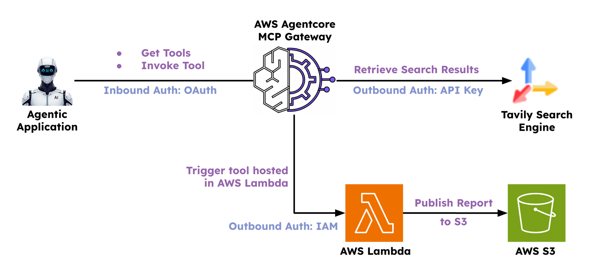

# Challenge: Integrations (MCP)

> **Cost note:** This challenge uses AWS AgentCore MCP Gateway and Lambda, which have their own AWS pricing. Usage in a dev/test context is typically minimal, but worth keeping an eye on.

This challenge builds on the emerging technology research application from previous sections. Your goal is to expose tools via an MCP Gateway and integrate them into the application. By the end, the flow will look like this:

---

## Task 1: Create the MCP Gateway with Two Targets

Create an [MCP Gateway](https://docs.aws.amazon.com/bedrock-agentcore/latest/devguide/gateway.html) and add two targets, which will later be available as tools in the agentic application:

- **Tavily Search Target** — searches the internet and makes results available to the agent.
- **Lambda function target** — publishes reports to AWS S3. You may choose a different target type if preferred; the key goal is to have a mechanism that updates an external system.

---

## Task 2: Try Out the MCP Gateway Using MCP Inspector

[MCP Inspector](https://modelcontextprotocol.io/docs/tools/inspector) is an open-source tool originally developed by Anthropic. Use it to explore the MCP Gateway you created in Task 1. To connect, you'll need to generate a bearer token in the terminal first.

---

## Task 3: Integrate MCP in the Agentic Application

Use [MCPServerAdapter](https://docs.crewai.com/en/mcp/overview) to connect to the MCP Gateway and fetch tools. You'll need a bearer token for authentication. These tools can then be used by any CrewAI agent — for example:

- A **researcher agent** using the Tavily tool to search the internet.
- A **publishing agent** using the publish tool to push the final report to its destination.

---
