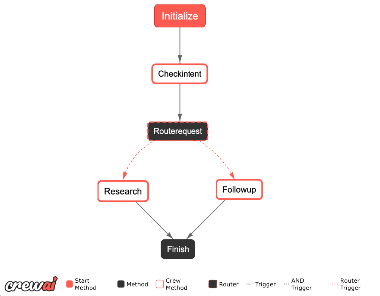
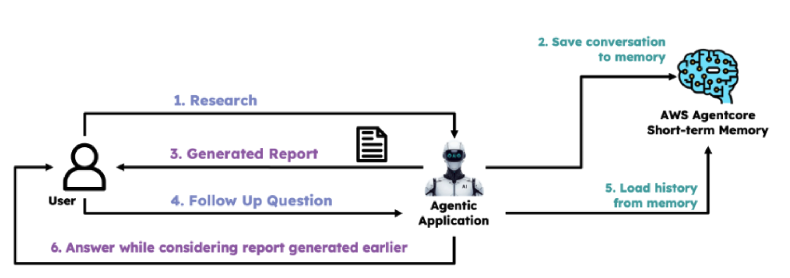
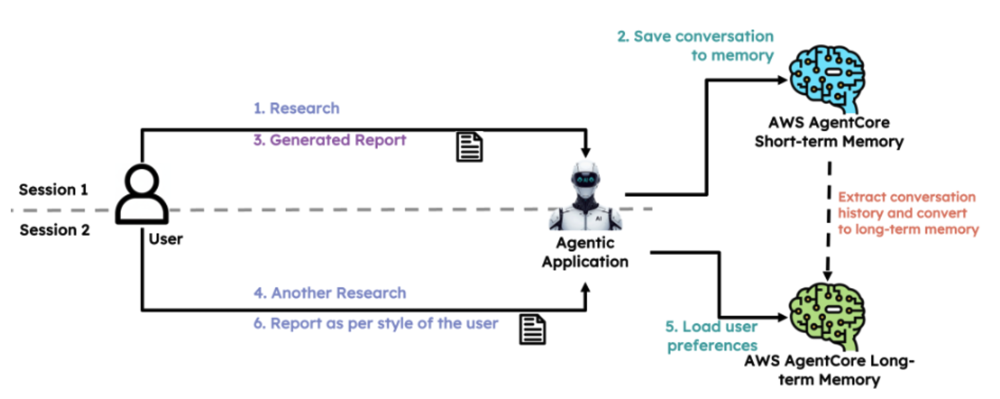

# Challenge: Agent Memory

> **Cost note:** This challenge uses AWS AgentCore Memory, which has its own pricing separate from LLM calls. Check the AWS free tier limits before running many iterations.

This challenge builds on the emerging technology research application from previous sections. Your goal is to add both short-term and long-term memory, turning it into a proper chat application.

---

## Task 1: Convert the Application to a Chat Application

This task sets the stage for using memory. Switch from a single CrewAI crew to a flow of crews. In the sample flow:

- First, the intent is analyzed from user input.
- If the intent is **research**, the existing research flow is used.
- If the intent is a **follow-up question**, a new follow-up question crew handles it — with access only to internet search tools.

At this stage, follow-up questions won't yet have access to conversation history (that's fixed in the next task). Useful resources:

- [CrewAI flows](https://docs.crewai.com/en/concepts/flows)
- Converting to a chat interface (pick one):
  - [Using Streamlit](https://docs.streamlit.io/develop/tutorials/chat-and-llm-apps/build-conversational-apps) — trigger a CrewAI Flow instead of OpenAI
  - Using a simple `while` loop with Python's [`input()`](https://www.w3schools.com/python/ref_func_input.asp)

---

## Task 2: Implement Short-Term Memory using AWS AgentCore Memory

Use [AWS AgentCore short-term memory](https://docs.aws.amazon.com/bedrock-agentcore/latest/devguide/using-memory-short-term.html) to store conversation history. At the end of each research request, store the output in short-term memory. At the start of the next request, pull that history and pass it to the follow-up crew so it can answer questions based on previously conducted research.

---

## Task 3: Implement Long-Term Memory using AWS AgentCore Memory

Extract user preferences from the conversation history and store them in [AWS AgentCore long-term memory](https://docs.aws.amazon.com/bedrock-agentcore/latest/devguide/long-term-memory-long-term.html). Use the [built-in user preferences extraction strategy](https://docs.aws.amazon.com/bedrock-agentcore/latest/devguide/long-term-configuring-built-in-strategies.html#long-term-user-preferences-strategy) to handle extraction automatically. Before each research request, pull the stored preferences and pass them to the research crew to guide its output.

---
