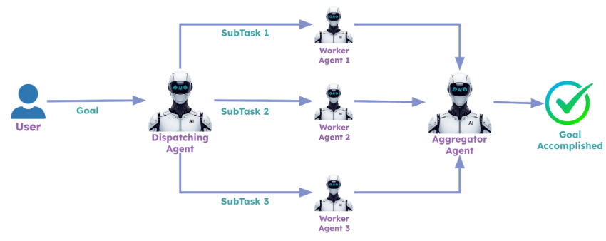
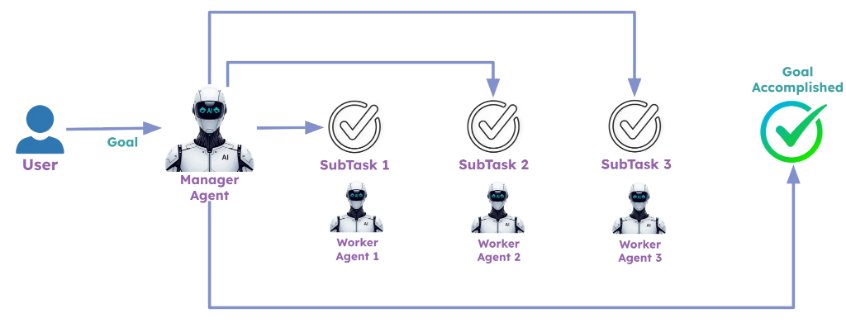

# Challenge: Agentic Patterns

> **Cost note:** Generating banner images via DALL-E incurs image generation costs on top of LLM usage. Run a few iterations to test, rather than in bulk.

This challenge builds on the emerging technology research application from previous sections. Your goal is to implement two agentic patterns: parallel execution and orchestrator-worker.

---

## Task 1: Parallel Execution Pattern

This pattern runs multiple worker agents in parallel. In the demo, the CrewAI flow was modified to generate multiple banner images in parallel for each report section. For this challenge, create a new crew for banner image creation and use it just after the research report has been created. Useful resources:

- [CrewAI DALL-E tool](https://docs.crewai.com/en/learn/dalle-image-generation)
- [Running CrewAI crews asynchronously](https://docs.crewai.com/en/learn/kickoff-async)

---

## Task 2: Orchestrator-Worker Pattern

This pattern lets a manager agent create sub-tasks and assign them to worker agents. In the demo, a new crew called Orchestrator Worker Crew was created to implement this. Do something similar for your application. Refer to the [CrewAI hierarchical process docs](https://docs.crewai.com/en/learn/hierarchical-process) for configuration guidance.

---
