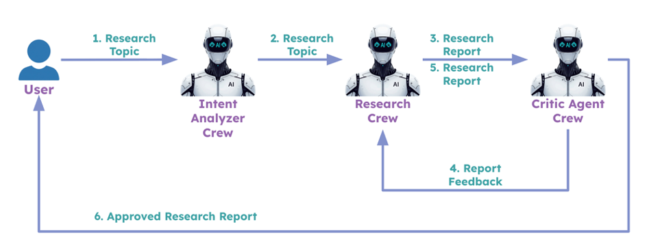
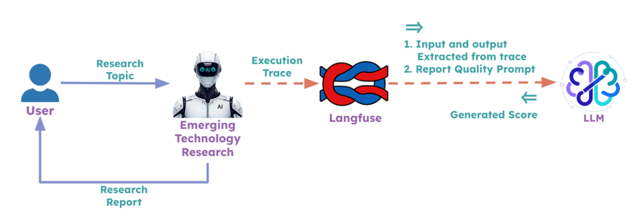

# Challenge: Agent Evaluation

This challenge is about building what the instructor demonstrated in the section videos. Your goal is to add inline evaluation using a critic agent and online evaluation using LLM as a judge via Langfuse. The current folder contains the reference implementation from the instructor. You can refer to that code as well as the README.md in this folder for guidance.

> **Cost note:** Running a critic agent adds one extra LLM call per research cycle. It's a small overhead — just worth keeping in mind if you run many iterations.

---

## Task 1: Implement Critic Agent Pattern for Inline Evaluation

Integrate a critic agent into the CrewAI flow. After the research crew prepares a report, the critic agent crew evaluates it and provides feedback. The research crew then uses this feedback to refine and improve the report's quality, resulting in a better final output for the user. You may use [CrewAI flows](https://docs.crewai.com/en/concepts/flows) to orchestrate the whole flow.

---

## Task 2: Using LLM as a Judge for Online Evaluation

Use the "LLM as a judge" mechanism to score emerging technology research execution traces. Refer to the [Langfuse documentation](https://langfuse.com/docs/evaluation/evaluation-methods/llm-as-a-judge) on how to set this up.

---