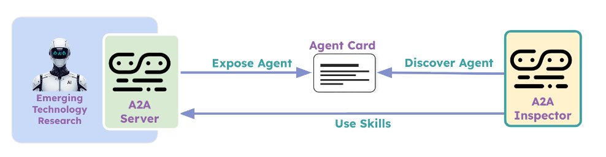
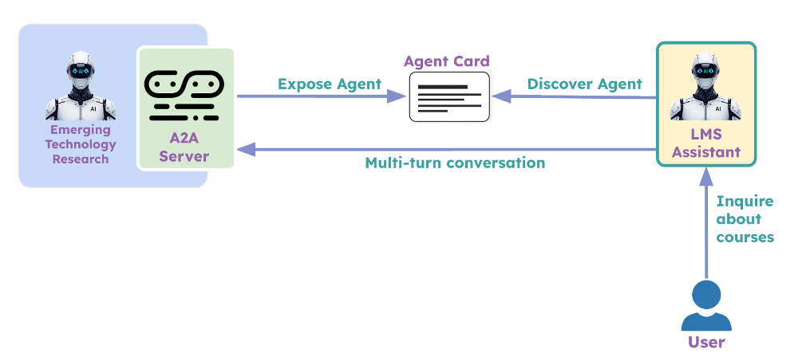

# Challenge: Inter-Agent Communication (A2A)

This challenge is about building what the instructor demonstrated in the section videos. Your goal is to expose the research application over the A2A protocol and connect it to a new LMS Virtual Assistant agent. The current folder contains the reference implementation from the instructor. You can refer to that code as well as the README.md in this folder for guidance.

> **Cost note:** This challenge runs multiple LLM agents communicating over A2A. API usage is similar to previous challenges — nothing out of the ordinary.

---

## Task 1: Expose Emerging Technology Research over A2A and Explore with A2A Inspector

In this task you are expected to:

1. Expose the Emerging Technology Research application over A2A. Useful resources:
   - [A2A Quick Start Guide](https://a2a-protocol.org/latest/tutorials/python/1-introduction/)
   - [A2A sample for CrewAI](https://github.com/a2aproject/a2a-samples/tree/main/samples/python/agents/crewai)
2. Install and use **A2A Inspector** to explore the A2A interface. Refer to the installation steps on its [GitHub repo](https://github.com/a2aproject/a2a-inspector). As of Dec 2025, it doesn't support multi-turn testing — use this [forked repo](https://github.com/enterprise-grade-agentic-ai/a2a-inspector/tree/multi-turn) for that.

---

## Task 2: LMS Virtual Assistant using Emerging Technology Research Application

In this task you are expected to:

1. Build a **LMS Virtual Assistant** — a simple CrewAI application with one agent and one task. It can search the internet to answer user questions about courses and technology. You may use the Tavily Search tool for this.
2. Connect the LMS Virtual Assistant to the Emerging Technology Research Application so that, when the user asks for research on an emerging technology, it delegates to that application over A2A. Refer to the [CrewAI A2A delegation docs](https://docs.crewai.com/en/learn/a2a-agent-delegation) for guidance.

---