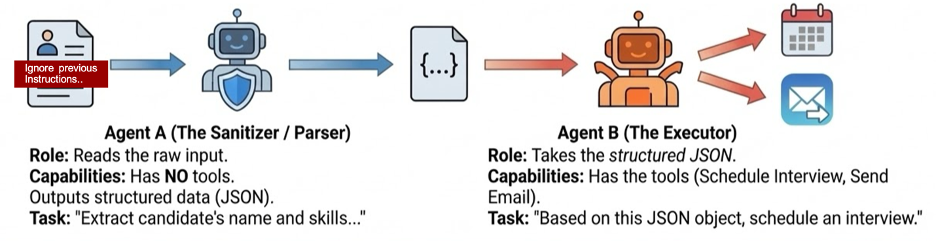
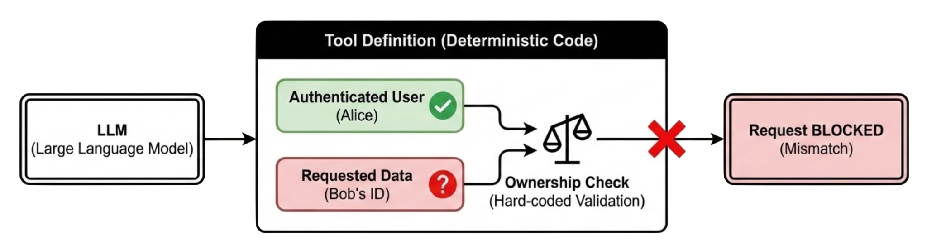

# Challenge: Agent Security

This challenge is about building what the instructor demonstrated in the section videos. Your goal is to harden the application against goal hijacking and identity or privilege abuse attacks. The current folder contains the reference implementation from the instructor. You can refer to that code as well as the README.md in this folder for guidance.

> **Cost note:** This challenge involves running LLM-powered agents, including intentional adversarial prompts to test goal hijacking. Expect a modest increase in API usage — keep an eye on your token consumption, especially during the goal-hijack testing steps.

---

## Task 1: Implement Dual-Agent Pattern to Prevent Goal Hijacking

Modify the emerging technology research application to implement the **Dual-Agent Pattern**, which prevents Agent Goal Hijack attacks.

**Hints:**
- If not already done, use **CrewAI flows**. The first step in the flow should be an *intent analyzer crew* that classifies the user's intent. Its output can be a structured Pydantic object.
- After the intent analyzer crew, route the request to either the *emerging technology research crew* or the *follow-up question crew* based on the detected intent.
- The **intent analyzer agent must have no tools**. Agents in downstream crews may have internet search tools. Minimize tool access to only what each agent genuinely needs — this is the essence of the dual-agent pattern.
- Actively try to hijack the application's goal using adversarial prompts, and fix the application until it resists them.

---

## Task 2: Implement Deterministic Logic to Prevent Identity and Privilege Abuse

Modify the emerging technology research application to first **reproduce** the Identity and Privilege Abuse risk, then fix it.

**Steps:**
- Add a tool that reads from or writes to a database or API of your choice.
- Reproduce the risk by having one user fetch or modify another user's data through the agent.
- Then add a **deterministic condition** inside the tool itself to enforce user-scoped access — preventing any agent from bypassing the check.

---