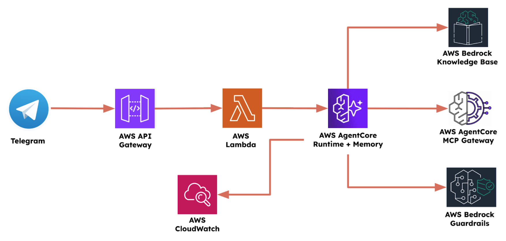

# Challenge: Orange Electronics Chatbot

This **optional** challenge is to build an end-to-end **chatbot for Orange Electronics**, integrated with Telegram for a complete user-facing experience.

> **Heads up on costs:** Cloud services may charge based on usage. The course examples use free or pay-per-use options where possible — just worth double-checking pricing before you run anything, and cleaning up any resources you no longer need.

The architecture shown below is what was covered in the demos. Feel free to follow it, adapt it, or design something entirely your own. This is your challenge, so approach it however makes sense to you. The demo code is available in this folder if you want a reference.

This is your chance to build a full Agentic AI system from scratch. Below are the pieces worth including. Think of them as a checklist to aim for rather than strict requirements:

* Multi-agent chatbot using CrewAI
* RAG (e.g. AWS Bedrock Knowledge Base)
* MCP (e.g. AWS AgentCore MCP Gateway)
* AgentCore Runtime
* Memory (e.g. AWS AgentCore Memory)
* Frontend (e.g. Telegram)
* Security and Safety features (e.g. AWS Bedrock Guardrails)
* Observability (metrics as well as traces)