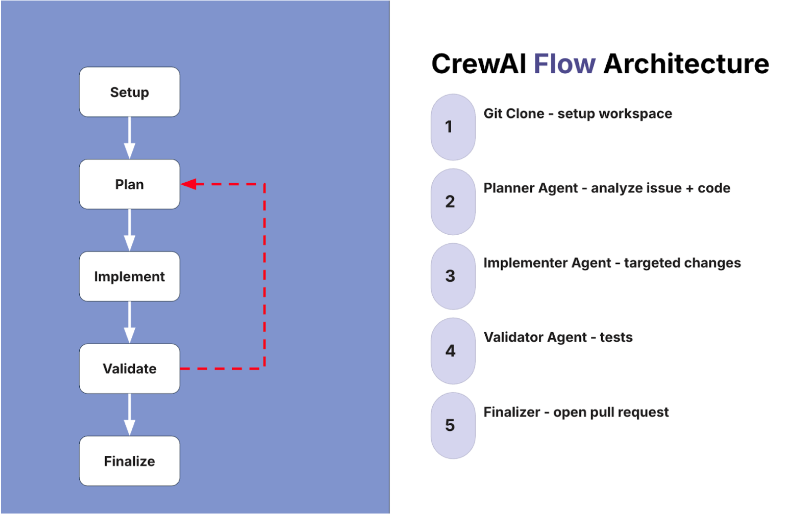

# Challenge: Github Issue Fixer

This challenge is about building what the instructor demonstrated in the section videos. Your goal is to build an agentic system that automatically diagnoses and fixes GitHub issues, then opens pull requests. The current folder contains the reference implementation from the instructor. You can refer to that code as well as the README.md in this folder for guidance.

> **Cost notice:** Cloud services and LLM APIs may incur charges. Review pricing before running this code. The reference implementation uses Claude Sonnet, which is among the higher-cost models.

The CrewAI flow shown in the demos is one way to approach this, but feel free to adapt it, simplify it, or design your own flow entirely. There is no single correct solution — how you tackle it is up to you. If you would like a reference point, the demo code from the course is available in this repository.

---